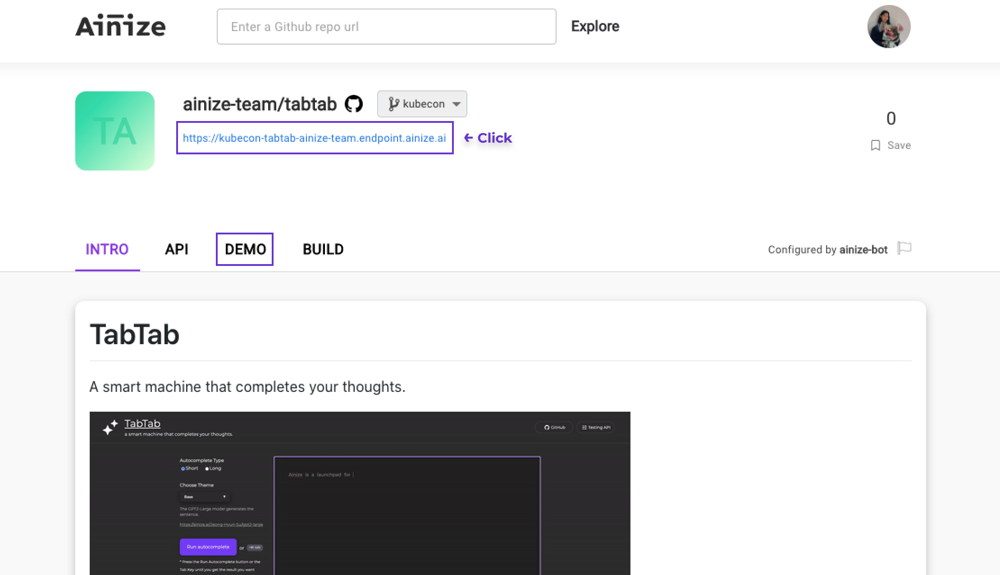

# TabTab (Project dGPT-2)

[](https://ainize.web.app/redirect?git_repo=https://github.com/ainize-team/tabtab)


TabTab is an open source AI project. It's a smart machine that completes your thoughts. <br/> By just entering the Tab key, it'll autocomplete your next sentences considering the context! <br/> It's powered by GPT-2 models. 


## How to develop TabTab on Ainize (with GPT-2 APIs)
-----
* Click this link -> https://link.ainize.ai/tabtab-tutorial
</br>
</br>

## Web Demo
----
Click the Demo tab or Enpoint link like this:


<br/>
<br/>

## How to run
-----

### Docker build
```
docker build -t $(YOUR_DOCKER_HUB_ID)/tabtab .
```

### Docker run
```
docker run -p 80:80 -d $(YOUR_DORCKER_HUB_ID)/tabtab
```
Now the server is available at http://localhost.
<br/>
<br/>


## List of related GPT-2 models
-----
* GPT2-Large: https://ainize.ai/Jeong-Hyun-Su/gpt2-large

* GPT2-Cover-Letter: https://ainize.ai/Jeong-Hyun-Su/gpt2-cover-letter

* GPT2-Reddit: https://ainize.ai/woomurf/gpt2-reddit

* GPT2-Story: https://ainize.ai/gmlee329/gpt2_story

* GPT2-Ads: https://ainize.ai/psi1104/gpt2-ads

* GPT2-Film: https://ainize.ai/gmlee329/gpt2_film

* GPT2-Trump: https://ainize.ai/gmlee329/gpt2_trump

* GPT2-Debate: https://ainize.ai/gmlee329/gpt2_debate

* GPT2-Business: https://ainize.ai/leesangha/gpt2-business

